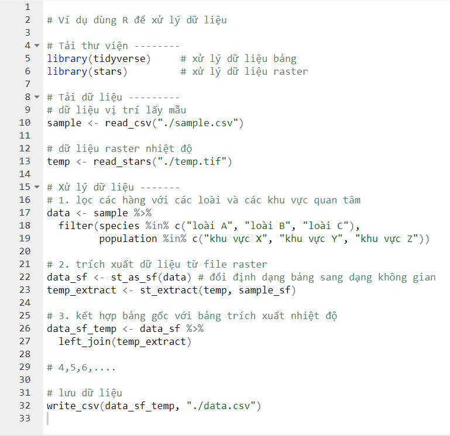
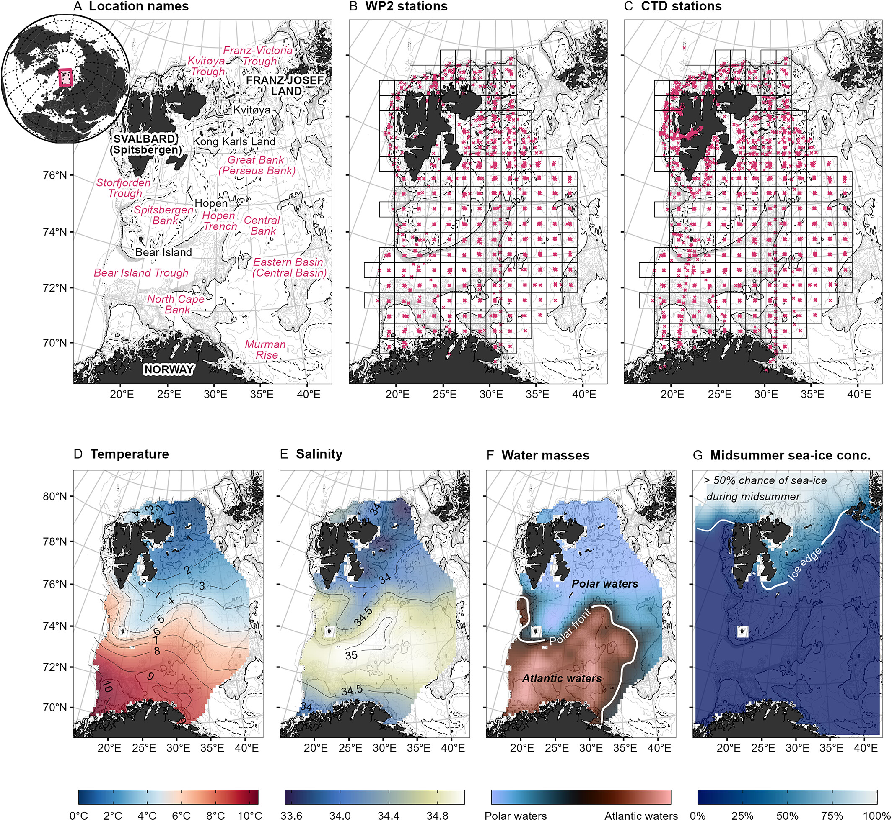

```{r setup, include=FALSE}
knitr::opts_chunk$set(
  echo      = T, 
  message   = F, 
  warning   = F, 
  comment   = NA,
  R.options = list(width = 120),
  cache.rebuild = F,
  cache = T,
  fig.align = 'center',
  fig.asp = .7,
  dev = 'svg',
  dev.args = list(bg = 'transparent')
)

library(tidyverse)
# library(broom)
library(kableExtra)
# library(visibly)
library(glmmTMB)
library(reactable)
library(patchwork)

kable_df <- function(..., digits=2) {
  kable(..., digits=digits) %>% 
    kable_styling(full_width = F)
}

rnd = tidyext::rnd #https://m-clark.github.io/tidyext/ #devtools::install_github('m-clark/tidyext')
theme_set(theme_bw())
```

Nếu bạn đang học về hoặc đang làm nghiên cứu khoa học thì có lẽ bạn đã
nghe đến [R](https://www.r-project.org/). R là một "môi trường phần mềm
miễn phí dành cho tính toán thống kê và đồ họa" được dùng phổ biến trong
nghiên cứu khoa học. Trong bài viết này, mình sẽ nêu các lý do bạn nên
dùng R cho việc thu thập, xử lý, phân tích, và trực quan hóa dữ liệu.

**Miễn phí**

Chính xác, lý do đầu tiên và vô cùng quan trọng cho việc dùng R là vì nó
**miễn phí**. Chi phí của các phần mềm phân tích dữ liệu bản quyền
thường rất cao. Ví dụ, phiên bản có giá thấp nhất của Stata là khoảng
[89 USD/năm](#0), SPSS là khoảng [1200 USD/năm](#0), và ArcGIS là khoảng
[100 USD/năm](https://www.trustradius.com/products/arcgis/pricing). Đây
là một rào cản rất lớn với những người dùng là sinh viên hoặc nhà nghiên
cứu nghèo nói chung và từ Việt Nam nói riêng. Sự tồn của R, hay các phần
mềm mã nguồn mở khác như [QGIS](#0), đã phá bỏ rào cản này. Cộng với sự
phát triển của cộng đồng người dùng, nhiều thư viện (package) đã được
xây dựng và giúp việc sử dụng R cho việc thu thập, xử lý, phân tích, và
trực quan hóa dữ liệu trở nên dễ dàng và có thể còn vượt trội hơn những
công cụ truyền thống.

**Có thể thu thập (một số) dữ liệu** **dễ dàng**

Bạn có thể dùng R để tải trực tiếp dữ liệu từ một số cơ sở dữ liệu mở.
Một số ví dụ trong ngành mình mà mình biết như dữ liệu đa dạng sinh học
từ [Ocean Biodiversity Information System](https://obis.org/) (thư viện
[*robis*](https://github.com/iobis/robis)), [Global Biodiverstiy
Information Facility](https://www.gbif.org/) (thư viện
[*rgbif*](https://github.com/ropensci/rgbif)); dữ liệu đánh bắt cá từ
[Global Fishing Watch](https://globalfishingwatch.org/) (thư viện
[*gfwr*](https://github.com/GlobalFishingWatch/gfwr)); dữ liệu ảnh vệ
tinh và dữ liệu không gian từ [Google Earth
Engine](https://earthengine.google.com/) (thư viện
[*rgee*](https://github.com/r-spatial/rgee)); hoặc dữ liệu khí hậu từ
[European Centre for Medium-Range Weather
Forecasts](https://www.ecmwf.int/) (thư viện
[*ecmwfr*](https://github.com/bluegreen-labs/ecmwfr)). Những thư viện
như kể trên cho phép bạn tùy biến việc tải dữ liệu theo thời gian và khu
vực bạn quan tâm, thay vì phải tải từng phần hoặc toàn bộ dữ liệu
(thường có kích thước rất lớn) rồi sau đó mới xử lý như cách thông
thường.

**Có thể xử lý dữ liệu dễ dàng và có hệ thống**

Bạn có thể dùng R để xử lý dữ liệu ở các định dạng khác nhau một cách dễ
dàng. Ví dụ với dữ liệu dạng bảng (giống như chúng ta hay quen trong
Excel), thì bạn có thể lọc dữ liệu theo cột hoặc theo hàng, thêm cột mới
bằng cách kết hợp các cột đã có, tổng hợp các dữ liệu theo nhóm, hoặc
kết hợp nhiều bảng khác nhau. Một ví dụ khác với dữ liệu không gian như
là trích xuất các giá trị nhiệt độ tại các vị trí lấy mẫu (dạng bảng, có
cột kinh độ và vĩ độ) từ một file raster nhiệt độ (dữ liệu dạng ô lưới
trên một khu vực); trước đây thì mình sẽ làm việc này trong QGIS nhưng
bây giờ mình sẽ làm luôn trong R.

Bên cạnh khả năng xử lý dữ liệu thì việc dùng R giúp bạn quản lý việc xử
lý dữ liệu một cách hệ thống. Từ đó bạn có thể (1) kiểm tra lại quy
trình xử lý dữ liệu nếu có sai sót và (2) lặp lại quy trình một cách
nhanh chóng với các dự án khác. Ví dụ, giả sử với dữ liệu đầu vào bao
gồm 1 dữ liệu các vị trí lấy mẫu (với thông tin các loài và các khu vực
lấy mẫu khác nhau) và 1 dữ liệu raster nhiệt độ, bạn có một quy trình xử
lý dữ liệu gồm 10 bước như lọc các hàng với các loài và các khu vực quan
tâm, trích xuất nhiệt độ từ file raster, kết hợp bảng gốc với bảng trích
xuất nhiệt độ, tính giá trị nhiệt độ trung bình theo khu vực, .... Sau
khi làm 10 bước, bạn phát hiện là bạn đã tính nhầm giá trị nhiệt độ lớn
nhất chứ không phải giá trị nhiệt độ trung bình. Nếu bạn xử dụng Excel
để xử lý dữ liệu thì bạn sẽ phải làm lại một hoặc nhiều bước từ đoạn
tính toán, nhưng nếu bạn dùng R thì bạn chỉ việc thay đổi một vài dòng
lệnh và chạy lại quy trình 1 lần. Thêm nữa, nếu bạn có một dự án khác
với dữ liệu đầu vào và yêu cầu về dữ liệu đầu ra tương tự, bạn sẽ phải
thực hiện lại 10 bước xử lý, nhưng nếu bạn dùng R thì bạn chỉ việc chạy
lại quy trình 1 lần. Trong thực tế thì có thể sẽ có những sai sót không
dễ phát hiện và có thể quy trình xử lý dữ liệu của bạn bao gồm rất nhiều
bước. Khi đó, việc sử dụng R sẽ có ích rất nhiều.

```{r fig1, echo=FALSE, out.width="100%", fig.cap="Ví dụ code xử lý dữ liệu trong R"}

```

**Có thể phân tích dữ liệu với các phương pháp hiện đại nhất**

Như mình đề cập ở phần đầu, cùng với sự phát triển của cộng đồng người
dùng R, đặc biệt là các nhà nghiên cứu, thì nhiều thư viện đã được xây
dựng hỗ trợ cho việc phân tích dữ liệu (cũng như thu thập, xử lý, và
trực quan hóa dữ liệu). Bên cạnh những phương pháp phân tích cơ bản có
sẵn trên R như t-test, anova, hồi quy tuyến tính (linear regression),
bạn có thể thực hiện các phương pháp phức tạp hơn như mô hình hỗn hợp
(mixed-effects model - thư viện
[*lme4*](https://cran.r-project.org/web/packages/lme4/index.html) hoặc
[*glmmTMB*](https://cran.r-project.org/web/packages/glmmTMB/index.html)),
mô hình hồi quy cộng tính tổng quát (generalized additive model - thư
viện [*mgcv*](https://cran.r-project.org/web/packages/mgcv/index.html)),
mô hình không gian (spatial model - thư viện
[*sdmTMB*](https://cran.r-project.org/web/packages/sdmTMB/index.html)
hoặc [*INLA*](https://www.r-inla.org/)). Thông thường, nếu các nhà
nghiên cứu phát triển một phương pháp mới hoặc ứng dụng một phương pháp
có thể không mới nhưng lần đầu tiên trên R thì họ sẽ công bố kèm với thư
viện hoặc file code hướng dẫn. Vì thế, người dùng R có thể cập nhật
những phương pháp mới nhất trong nghiên cứu. Ví dụ, thư viện *INLA* được
phát triển năm 2009 [@rue2009] và đã mở đường cho rất nhiều các nghiên
cứu ứng dụng phân tích không gian (xem @Bakka2018 và @VanNiekerk2023);
gần đây hơn thư viện *sdmTMB* được phát triển năm 2022 [@Anderson2022]
và được đánh giá là có thời gian chạy mô hình ngắn hơn nhiều so với
*INLA*.

**Có thể trực quan hóa (hầu hết) mọi dạng dữ liệu**

Với R, bạn có thể thể trực quan hóa hầu hết hoặc thậm chí là tất cả các
kiểu dữ liệu. Để dễ hình dung thì bạn có thể xem các kiểu biểu đồ tương
ứng với các kiểu dữ liệu khác nhau và các đoạn code R mẫu tương ứng ở
[đây](https://www.data-to-viz.com/#histogram); hoặc xem ví dụ một hình
được "vẽ" trong R mà mình thấy rất ấn tượng ở dưới. Bên cạnh đó thì bạn
cũng có thể xuất các kết quả phân tích ở dạng bảng theo yêu cầu (ví dụ
như theo mẫu của nhà xuất bản).

```{r fig2, echo=FALSE, out.width="100%", fig.cap="Ví dụ trực quan hóa dữ liệu trong R. Hình 1 trong @Langbehn2023"}

```

**2 lý do khác**

Các lý do mình nêu ở trên tập trung vào mô tả về R: "môi trường phần mềm
**miễn phí** dành cho **tính toán thống kê và đồ họa**". Sau đây mình sẽ
nêu 2 lý do khác cho việc sử dụng R bao gồm:

-   Tính tái lập (reproducibility): các file code R sẽ mô tả toàn bộ quá
    trình công việc của bạn, từ tải dữ liệu từ file nào (nằm ở thư mục
    nào), các bước xử lý dữ liệu tuần tự như nào, dùng phương pháp phân
    tích nào, đến trực quan hóa dữ liệu ra sao. Việc này có 2 lợi ích:
    thứ nhất bạn có thể tái lập các bước đã thực hiện để kiểm tra nếu có
    lỗi hoặc áp dụng các code đã có (một phần hoặc toàn bộ) cho các dự
    án khác của bạn; và thứ hai bạn có thể tái lập (hoặc học phương
    pháp) những nghiên cứu khác hoặc những nhà nghiên cứu khác sẽ có thể
    tái lập (hoặc học phương pháp) nghiên cứu của bạn. Lý do thứ hai đặc
    biệt quan trọng trong nghiên cứu khoa học và việc công khai dữ liệu
    hoặc/và các file code sử dụng trong nghiên cứu được khuyến khích bởi
    hầu hết các tạp chí khoa học.
-   Cộng đồng người dùng lớn: giúp bạn có thể tìm câu trả lời cho hầu
    hết các vấn đề trong quá trình sử dụng R của bạn, từ những vấn đề
    chung chung (ví dụ như trên
    [stackoverflow](https://stackoverflow.com/)) đến những vấn đề cụ thể
    của một thư viện nào đó (có thể tìm trong phần issues trên github
    của thư viện).

Để kết luận thì R là một công cụ miễn phí và hiệu quả cho việc thu thập,
xử lý, phân tích, và trực quan hóa dữ liệu nói chung và trong nghiên cứu
khoa học nói riêng. Có lẽ rào cản lớn nhất khi sử dụng R là bạn phải học
lập trình. Tuy nhiên với rất nhiều các tài liệu dạy R (cả miễn phí và có
phí) thì mình nghĩ rào cản này không quá khó để vượt qua. Hi vọng bài
viết này sẽ giúp các bạn chưa dùng R có thêm cảm hứng và động lực để tìm
hiểu và sử dụng R trong nghiên cứu.
