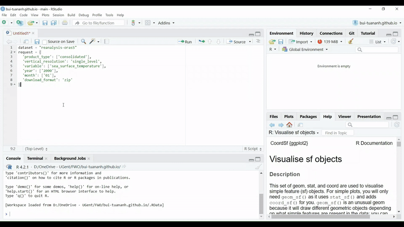

```{r setup, include=FALSE}
knitr::opts_chunk$set(
  echo      = T, 
  message   = F, 
  warning   = F, 
  comment   = NA,
  R.options = list(width = 120),
  cache.rebuild = F,
  cache = T,
  fig.align = 'center',
  fig.asp = .7,
  dev = 'svg',
  dev.args = list(bg = 'transparent')
)

library(ecmwfr)    # tải dữ liệu cds
library(tidyverse) # xử lý và trực quan hóa dữ liệu
library(sf)        # xử lý dữ liệu không gian dạng vector
library(stars)     # xử lý dữ liệu không gian dạng raster
# library(broom)
library(kableExtra)
# library(visibly)
#library(glmmTMB)
library(reactable)
library(patchwork)


kable_df <- function(..., digits=2) {
  kable(..., digits=digits) %>% 
    kable_styling(full_width = F)
}

rnd = tidyext::rnd #https://m-clark.github.io/tidyext/ #devtools::install_github('m-clark/tidyext')
theme_set(theme_bw())
```

# Giới thiệu

[Copernicus Climate Data Store](https://cds-beta.climate.copernicus.eu/)
là một cơ sở dữ liệu khí hậu mở của Liên minh Châu Âu và được vận hành
bởi [European Centre for Medium-Range Weather
Forecasts](https://www.ecmwf.int/). Thông qua Copernicus Climate Data
Store, người dùng có thể tiếp cận các bộ dữ liệu khí hậu mới nhất như:

-   Dữ liệu khí hậu đại dương
    [ORAS5](https://cds-beta.climate.copernicus.eu/datasets/reanalysis-oras5?tab=overview)
    từ 1958 đến hiện tại (lần cập nhật gần nhất vào 15/07/2024)

-   Dữ liệu khí hậu mặt đất
    [ERA5-Land](https://cds-beta.climate.copernicus.eu/datasets/reanalysis-era5-land-monthly-means?tab=overview)
    từ 1950 đến hiện tại (lần cập nhật gần nhất vào 06/09/2024)

# Chuẩn bị

1.  Tải thư viện [*ecmwfr*](https://github.com/bluegreen-labs/ecmwfr) và
    các thư viện khác

```{r}
library(ecmwfr)    # tải dữ liệu cds
library(tidyverse) # xử lý và trực quan hóa dữ liệu
library(sf)        # xử lý dữ liệu không gian dạng vector
library(stars)     # xử lý dữ liệu không gian dạng raster
```

2.  Tạo tài khoản trên trang [European Centre for Medium-Range Weather
    Forecasts](https://www.ecmwf.int/)
3.  Đăng nhập ở trang [Copernicus Climate Data
    Store](https://cds-beta.climate.copernicus.eu/) (trang đăng nhập sẽ
    tự động được điều hướng sang trang [European Centre for Medium-Range
    Weather Forecasts](https://www.ecmwf.int/) để đăng nhập bằng tài
    khoản đã tạo ở bước 2).
4.  Lấy mã truy cập dữ liệu (Personal Access Token) ở trang
    [profile](https://cds-beta.climate.copernicus.eu/profile) của
    Copernicus Climate Data Store và đặt mã truy cập. Lưu ý tránh để lộ
    mã truy cập này.

```{r, eval=F, echo=T}
# Đặt mã truy cập (Personal Access Token)
wf_set_key(key = "xxxxxxxx-xxxx-xxxx-xxxx-xxxxxxxxxxxx")
```

# Tải dữ liệu ORAS5

1.  Lấy API tải dữ liệu: chọn các thuộc tính của dữ liệu cần tải bao
    gồm: kiểu dữ liệu (product type, dữ liệu lịch sử trước 2014
    [consolidated] hay dữ liệu mô hình từ 2015 [operational]), cấu trúc
    dữ liệu (vertical resolution, một lớp hay nhiều lớp), biến
    (variable), năm (year), tháng (month). Để ví dụ thì mình chọn như
    sau:
    -   kiểu dữ liệu: tất cả
    -   cấu trúc dữ liệu: một lớp
    -   biến: nhiệt độ bề mặt nước biển (sea surface temperature)
    -   năm: 2000
    -   tháng: 1


2.  Chuyển đổi API tải dữ liệu từ python sang R bằng addins **ECMWF
    Python to list**: API tải dữ liệu mặc định trên Copernicus Climate
    Data Store là dành cho python nên cần phải chuyển sang ngôn ngữ R.



3.  Nhập API tải dữ liệu: có thể đổi tên của file nếu cần

```{r}
# API mặc định từ ECMWF Python to list, tên file là "TMPFILE"
request <- list(
  dataset_short_name = "reanalysis-oras5",
  product_type = "consolidated",
  vertical_resolution = "single_level",
  variable = "sea_surface_temperature",
  year = "2000",
  month = "01",
  download_format = "zip",
  target = "TMPFILE"
)

# API với tên file "oras5.zip"
request <- list(
  dataset_short_name = "reanalysis-oras5",
  product_type = "consolidated",
  vertical_resolution = "single_level",
  variable = "sea_surface_temperature",
  year = "2000",
  month = "01",
  download_format = "zip",
  target = "oras5.zip"
)
```

4.  Tải dữ liệu: tùy thuộc vào lượng dữ liệu cần tải (một hay nhiều lớp,
    biến, năm, tháng) mà dung lượng dữ liệu có thể dao động từ rất nhỏ
    (vài MB) đến rất lớn (vài hoặc hàng chục GB).

```{r, eval=F, echo=T}
file <- wf_request(
 request  = request,  # API ở bước 3
 transfer = TRUE,     # TRUE để tải file 
 path     = "."       # Thư mục lưu file, "." nghĩa là sẽ lưu ở thư mục làm việc hiện tại  (working directory)
 )

# kiểm tra thư mục làm việc hiện tại
getwd()
```

5.  Đọc file sau khi đã tải xong: file được giải nén từ oras5.zip.

```{r}
oras5 <- read_ncdf("./sosstsst_control_monthly_highres_2D_200001_CONS_v0.1.nc")

oras5
```

-   dữ liệu ORAS5 có 3 chiều (dimensions): kinh độ (x), vĩ độ (y), và
    thời gian (time_counter); và 1 thuộc tính (attribute): nhiệt độ bề
    mặt nước biển (sostsst)

-   vì dữ liệu ORAS5 có phạm vi toàn cầu nên để tiện hiển thị mình sẽ
    cắt quanh khu vực Việt Nam

```{r}
# cắt dữ liệu gần khu vực Việt Nam
oras5_sub <- oras5[, 100:200, 500:600, ]
# 100:200 là thứ tự chiều kinh độ x
# 500:600 là thứ tự chiều vĩ độ y

oras5_sub 
```

-   dữ liệu sau khi cắt có phạm vi kinh độ 97.5°-122.5° và vĩ độ
    0.26°-24.46°

```{r}
ggplot() +
  geom_stars(data = oras5_sub) +
  scale_fill_distiller(palette = "RdYlBu")
```

# Tải dữ liệu ERA5

1.  Lấy API tải dữ liệu và chuyển đổi API tải dữ liệu từ python sang R
    (tương tự như bước 1-2 ở phần Tải dữ liệu ORAS5). Các lựa chọn thuộc
    tính của dữ liệu ở ERA5 bao gồm: kiểu dữ liệu (product type, theo
    tháng hay theo giờ), biến (variable), năm (year), tháng (month),
    thời gian (nếu dữ liệu theo giờ), phạm vi địa lý, định dạng dữ liệu.
    Để ví dụ thì mình chọn như sau:

    -   kiểu dữ liệu: theo tháng

    -   biến: tổng lượng mưa (Total precipitation)

    -   năm: 2000

    -   tháng: 1-12

    -   thời gian: không áp dụng

    -   phạm vi địa lý: kinh độ 97.5°-122.5° và vĩ độ 0.26°-24.46°
        (quanh khu vực Việt Nam tương tự như ở dữ liệu ORAS5)

    -   định dạng dữ liệu: NetCDF4 (file .nc giống như ở dữ liệu ORAS5)

2.  Nhập API và tải dữ liệu

```{r}
request <- list(
  dataset_short_name = "reanalysis-era5-land-monthly-means",
  product_type = "monthly_averaged_reanalysis",
  variable = "total_precipitation",
  year = "2000",
  month = c("01", "02", "03", "04", "05", "06", "07", "08", "09", "10", "11", "12"),
  time = "00:00",
  data_format = "netcdf",
  download_format = "zip",
  area = c(24.46, 97.5, 0.26, 122.5),
  target = "era5.zip"
)
```

```{r, eval=F, echo=T}
file <- wf_request(
 request  = request,  # API
 transfer = TRUE,     # TRUE để tải file 
 path     = "."       # Thư mục lưu file
 )
```

3.  Đọc file (đã được giải nén)

```{r}
era5 <- read_ncdf("./data_0.nc")

era5
```

-   dữ liệu ERA5 có 3 chiều (dimensions): kinh độ (longitude), vĩ độ
    (latitude), và thời gian (valid_time); và 1 thuộc tính (attribute):
    tổng lượng mưa (tp). Có 12 giá trị thời gian tương ứng với 12 tháng
    của năm 2000.

```{r}
ggplot() +
  geom_stars(data = era5) +
  scale_fill_distiller(palette = "GnBu", na.value = "white") +
  facet_wrap(~ valid_time)
```
