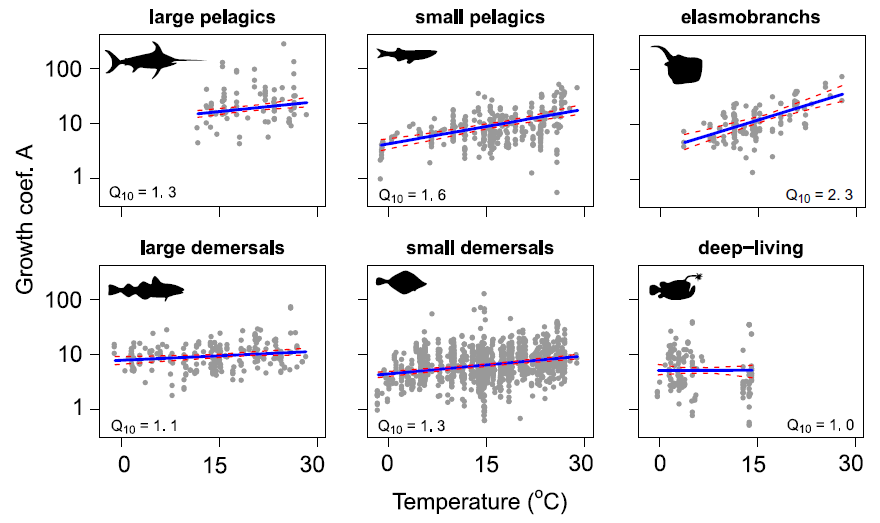

```{r setup, include=FALSE}
knitr::opts_chunk$set(
  echo      = T, 
  message   = F, 
  warning   = F, 
  comment   = NA,
  R.options = list(width = 120),
  cache.rebuild = F,
  cache = T,
  fig.align = 'center',
  fig.asp = .7,
  dev = 'svg',
  dev.args = list(bg = 'transparent')
)

library(ecmwfr)    # tải dữ liệu cds
library(tidyverse) # xử lý và trực quan hóa dữ liệu
library(sf)        # xử lý dữ liệu không gian dạng vector
library(stars)     # xử lý dữ liệu không gian dạng raster
# library(broom)
library(kableExtra)
# library(visibly)
#library(glmmTMB)
library(reactable)
library(patchwork)
library(tmap)      # hiển thị dữ liệu không gian
library(readxl)    # đọc dữ liệu Excel


kable_df <- function(..., digits=2) {
  kable(..., digits=digits) %>% 
    kable_styling(full_width = F)
}

rnd = tidyext::rnd #https://m-clark.github.io/tidyext/ #devtools::install_github('m-clark/tidyext')
theme_set(theme_bw())
```

van Denderen và cộng sự năm 2020 công bố một [nghiên
cứu](https://onlinelibrary.wiley.com/doi/abs/10.1111/geb.13189) cho thấy
sự thay đổi về tốc độ phát triển của cá khi nhiệt độ ấm lên trên thực tế
có thể thấp hơn so với dự đoán từ lý thuyết trao đổi chất
[@van2020global].

Tốc độ phát triển của cá là một đặc tính sinh học quan trọng. Các nghiên
cứu gần đây đã chỉ ra sự thay đổi về tốc độ phát triển của cá khi nhiệt
độ môi trường ấm lên, cùng với các thay đổi khác như trưởng thành sớm
hơn (thường ở kích thước nhỏ hơn), và đạt kích thước tối đa nhỏ hơn (xem
@baudron2014warming, @audzijonyte2020fish, @wang2020life). Những sự thay
đổi này ở cá nói riêng và ở các sinh vật biến nhiệt (ectothermic
organisms) nói chung được gọi là Temperature-Size Rule (tạm dịch là quy
luật nhiệt độ - kích thước) [@atkinson1994temperature].

Các dự đoán về sự thay đổi về tốc độ phát triển của cá khi nhiệt độ môi
trường ấm lên chủ yếu dựa trên lý thuyết trao đổi chất (ví dụ
@cheung2013shrinking) với ước tính thay đổi tương đối là khoảng 2.5 lần
khi nhiệt độ tăng 10 độ.

Nghiên cứu của van Denderen và cộng sự tổng hợp dữ liệu toàn cầu về tốc
độ phát triển của cá từ cơ sở dữ liệu mở
[FishBase](https://www.fishbase.se/search.php) và sau đó sử dụng mô hình
hỗn hợp (mixed-effects model) để phân tích mối quan hệ giữa tốc độ phát
triển của cá và nhiệt độ trung bình các khu vực. Kết quả cho thấy
đổi tương đối của tốc độ phát triển của cá khi nhiệt độ tăng 10 độ là khoảng 1.0-2.3 lần (Hình \@ref(fig:fig1)), thấp hơn so với mức 2.5 lần dự đoán từ lý thuyết trao đổi chất.

```{r fig1, fig.cap="Kết quả ước tính thay đổi tương đối của tốc độ phát triển của cá khi nhiệt độ tăng 10 độ [@van2020global]", echo = FALSE, out.width="100%"}

```
