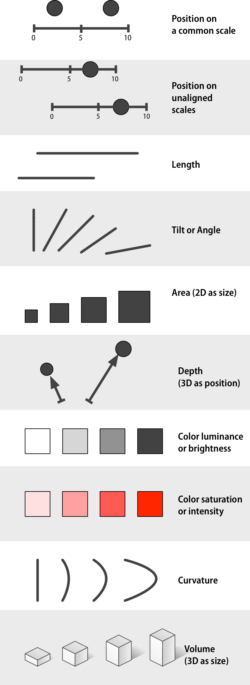
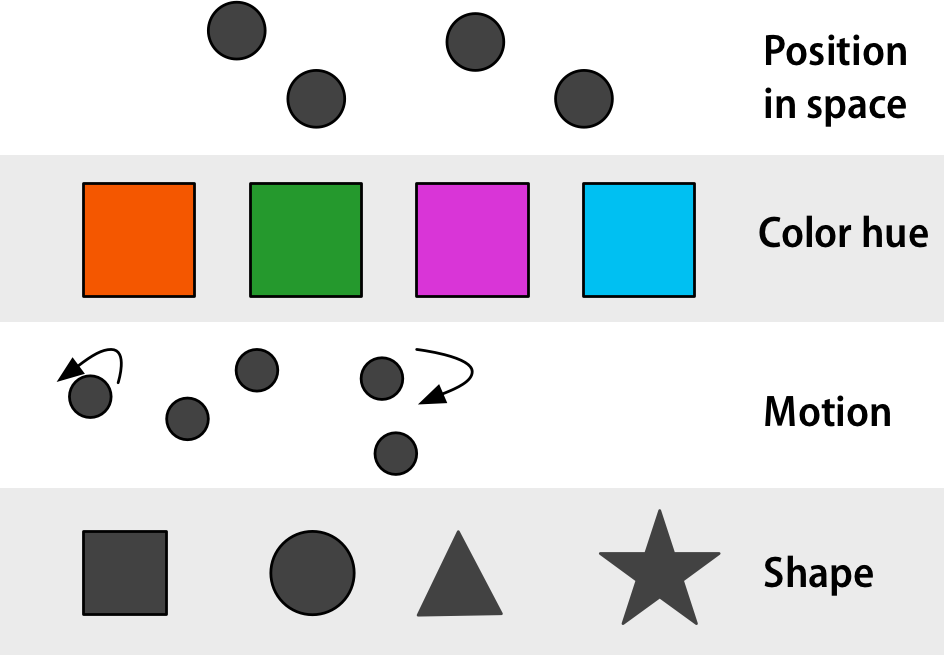
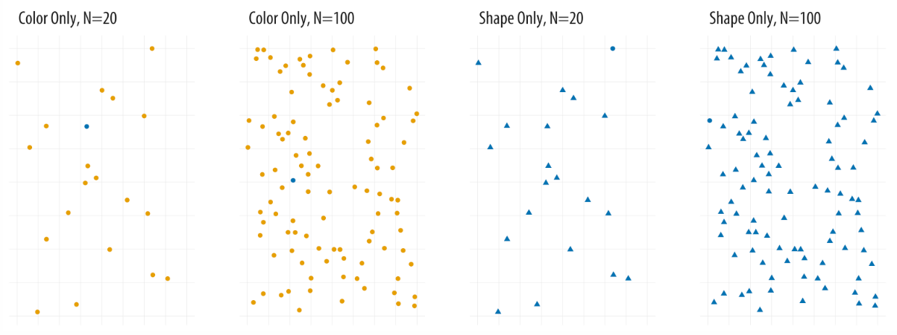

```{r setup, include=FALSE}
knitr::opts_chunk$set(
  echo      = T, 
  message   = F, 
  warning   = F, 
  comment   = NA,
  R.options = list(width = 120),
  cache.rebuild = F,
  cache = T,
  fig.align = 'center',
  fig.asp = .7,
  dev = 'svg',
  dev.args = list(bg = 'transparent')
)

library(ecmwfr)    # tải dữ liệu cds
library(tidyverse) # xử lý và trực quan hóa dữ liệu
library(sf)        # xử lý dữ liệu không gian dạng vector
library(stars)     # xử lý dữ liệu không gian dạng raster
# library(broom)
library(kableExtra)
# library(visibly)
#library(glmmTMB)
library(reactable)
library(patchwork)
library(tmap)      # hiển thị dữ liệu không gian
library(readxl)    # đọc dữ liệu Excel


kable_df <- function(..., digits=2) {
  kable(..., digits=digits) %>% 
    kable_styling(full_width = F)
}

rnd = tidyext::rnd #https://m-clark.github.io/tidyext/ #devtools::install_github('m-clark/tidyext')
theme_set(theme_bw())
```

Trực quan hóa dữ liệu giống như việc nén thông tin vào một biểu đồ với
mục tiêu là người đọc có thể giải nén và diễn giải các thông tin đã được
"nén". Tùy thuộc vào hình thức trực quan hóa dữ liệu mà các thông tin
được "nén" có thể được giải nén dễ dàng và chính xác hay không. Chương 1
của sách [Data Visualization: A practical
introduction](https://socviz.co/) tổng hợp các hình thức trực quan hóa
dữ liệu hiệu quả cho dữ liệu liên tục (continuous data) (Hình
\@ref(fig:fig1)) và dữ liệu phân loại (categorical data) (Hình
\@ref(fig:fig3)).

```{r fig1, fig.cap="Các hình thức trực quan hóa dữ liệu liên tục từ hiệu quả tới không hiệu quả theo thứ tự từ trên xuống dưới từ Chương 1 sách Data Visualization: A practical introduction (Hình 1.24)", echo = FALSE, out.width="50%"}

```

Ví dụ với dữ liệu liên tục, Hình \@ref(fig:fig2) minh họa sự khác biệt
giữa việc sử dụng "Vị trí trên cùng một trục" (Position on a common
scale - hình thức hiệu quả nhất) và "Độ nghiên hoặc góc" (Tilt or
Angle - hình thức ít hiệu quả hơn). Ta có thể thấy rất rõ là giá trị của
nhóm 4 cao hơn nhóm 1 khi dùng hình thức "Vị trí dữ liệu trên một trục"
(hình bên trái), nhưng sẽ khó để thấy hơn khi dùng hình thức "Độ nghiên
hoặc góc" (hình bên phải).

```{r fig2, fig.cap='Minh họa sự khác biệt giữa việc sử dụng hình thức "Vị trí trên cùng một trục" (Position on a common scale) và "Độ nghiên hoặc góc (Tilt or Angle)" cho dữ liệu liên tục phân loại', echo = FALSE, out.width="100%"}
y <- c(1, 1.3, 1.2, 1.1)
x <- c("Nhóm 1", "Nhóm 2", "Nhóm 3", "Nhóm 4")

p1 <- ggplot() +
  geom_point(aes(x = "", y = y, color = x)) +
  labs(x = NULL,
       y = "Giá trị giả định",
       color = NULL)

p2 <- ggplot() +
  geom_bar( aes(x="", y=y, fill=x), stat="identity", width=1, color="white") +
  coord_polar("y", start=0) +
  theme_void() +
  labs(fill = NULL)

p1|p2
```

```{r fig3, fig.cap="Các hình thức trực quan hóa dữ liệu phân loại từ hiệu quả tới không hiệu quả theo thứ tự từ trên xuống dưới từ Chương 1 sách Data Visualization: A practical introduction (Hình 1.25)", echo = FALSE, out.width="50%"}

```

Ví dụ với dữ liệu phân loại, Hình \@ref(fig:fig4) minh họa sự khác biệt
giữa việc sử dụng "Màu sắc" (Color hue - hình thức hiệu quả thứ hai) và
"Hình dạng" (Shape - hình thức ít hiệu quả nhất). Ta có thể thấy rất rõ
chấm tròn xanh khi dùng hình thức "Màu sắc" (hai hình bên trái), nhưng
sẽ khó để thấy hơn khi dùng hình thức "Hình dạng" (hai hình bên phải).

```{r fig4, fig.cap='Minh họa sự khác biệt giữa việc sử dụng hình thức "Màu sắc" (Color hue) và "Hình dạng" cho dữ liệu phân loại (Trích Hình 1.18 sách Data Visualization: A practical introduction)', echo = FALSE, out.width="100%"}

```
