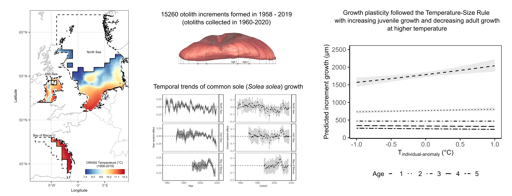

```{r setup, include=FALSE}
knitr::opts_chunk$set(
  echo      = T, 
  message   = F, 
  warning   = F, 
  comment   = NA,
  R.options = list(width = 120),
  cache.rebuild = F,
  cache = T,
  fig.align = 'center',
  fig.asp = .7,
  dev = 'svg',
  dev.args = list(bg = 'transparent')
)

library(ecmwfr)    # tải dữ liệu cds
library(tidyverse) # xử lý và trực quan hóa dữ liệu
library(sf)        # xử lý dữ liệu không gian dạng vector
library(stars)     # xử lý dữ liệu không gian dạng raster
# library(broom)
library(kableExtra)
# library(visibly)
#library(glmmTMB)
library(reactable)
library(patchwork)
library(tmap)      # hiển thị dữ liệu không gian
library(readxl)    # đọc dữ liệu Excel


kable_df <- function(..., digits=2) {
  kable(..., digits=digits) %>% 
    kable_styling(full_width = F)
}

rnd = tidyext::rnd #https://m-clark.github.io/tidyext/ #devtools::install_github('m-clark/tidyext')
theme_set(theme_bw())
```

Nghiên cứu của nhóm mình về sự phát triển của cá với tiêu đề "Otolith
increments in common sole (*Solea solea*) reveal fish growth plasticity
to temperature" mới được công bố trên tạp chí Estuarine, Coastal and
Shelf Science. Trong nghiên cứu này, nhóm mình đã sử dụng 60 năm dữ liệu
xương tai cá (otolith) để tìm hiểu sự thay đổi của sự phát triển của cá
ở cấp độ cá thể trước sự thay đổi của nhiệt độ. Kết quả chỉ ra rằng khi
nhiệt độ ấm lên, cá phát triển nhanh hơn khi chưa trưởng thành nhưng
phát triển chậm hơn khi đã trưởng thành (Hình \@ref(fig:fig1)). Nghiên
cứu của nhóm mình cung cấp thêm bằng chứng rằng sự phát triển của cá
thay đổi tuân theo Temperature-Size Rule [@atkinson1994temperature].
Trong nghiên cứu, nhóm mình cũng trực quan hóa phương pháp
"within-subject centering" [@vandepol2009Asimplemethod] để phân tách các
cấp ảnh hưởng của nhiệt độ: ảnh hưởng do sự khác biệt về mặt không gian
và thời gian ở cấp độ quần thể, ảnh hưởng do sự khác biệt giữa các cá
thể và trong cùng một cá thể ở cấp độ cá thể (Hình \@ref(fig:fig2)).
Nghiên cứu này là một phần của luận án Tiến sĩ của mình và có sự kết hợp
của Trường Đại học Ghent (UGent), Viện Nghiên cứu Nông nghiệp, Thủy sản,
và Thực phẩm vùng Flanders (ILVO), và Trường Đại học Wageningen (WUR).

Bạn có thể đọc về nghiên cứu của nhóm mình trên trang của nhà xuất bản
tại link sau: <https://doi.org/10.1016/j.ecss.2024.109041>. Sau ngày
20/05/2025, nghiên cứu sẽ được chia sẻ miễn phí trên thư viện của Trường
Đại học Wageningen tại link sau:
[https://edepot.wur.nl/680128](https://eur03.safelinks.protection.outlook.com/?url=https%3A%2F%2Fedepot.wur.nl%2F680128&data=05%7C02%7CTuanAnh.Bui%40ugent.be%7Cc1f2824253f741d3792508dd14705f4d%7Cd7811cdeecef496c8f91a1786241b99c%7C1%7C0%7C638689195055382475%7CUnknown%7CTWFpbGZsb3d8eyJFbXB0eU1hcGkiOnRydWUsIlYiOiIwLjAuMDAwMCIsIlAiOiJXaW4zMiIsIkFOIjoiTWFpbCIsIldUIjoyfQ%3D%3D%7C0%7C%7C%7C&sdata=Ns%2BJFIAL0GdQLVMwmb8aWPLzGIMxNeEz%2F4zLqBBER8k%3D&reserved=0 "Original URL: https://edepot.wur.nl/680128. Click or tap if you trust this link.").

```{r fig1, fig.cap="Các thông tin chính của nghiên cứu", echo = FALSE, out.width="100%"}

```

```{r fig2, fig.cap="Các cấp ảnh hưởng của nhiệt độ, phân tách theo phương pháp within-subject centering", echo = FALSE, out.width="100%"}
knitr::include_graphics("images/fig3_conceptual temperature effect.png")
```
