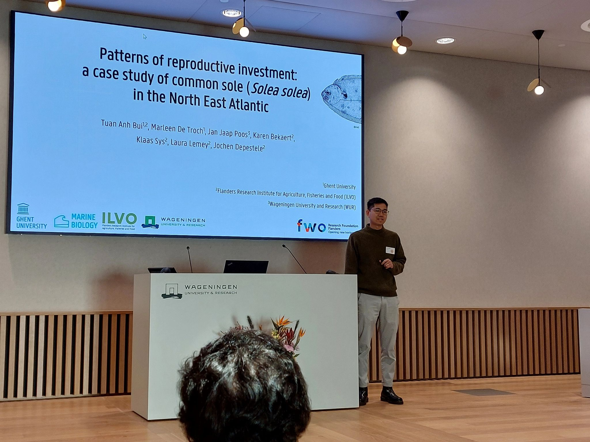

```{r setup, include=FALSE}
knitr::opts_chunk$set(
  echo      = T, 
  message   = F, 
  warning   = F, 
  comment   = NA,
  R.options = list(width = 120),
  cache.rebuild = F,
  cache = T,
  fig.align = 'center',
  fig.asp = .7,
  dev = 'svg',
  dev.args = list(bg = 'transparent')
)

library(ecmwfr)    # tải dữ liệu cds
library(tidyverse) # xử lý và trực quan hóa dữ liệu
library(sf)        # xử lý dữ liệu không gian dạng vector
library(stars)     # xử lý dữ liệu không gian dạng raster
# library(broom)
library(kableExtra)
# library(visibly)
#library(glmmTMB)
library(reactable)
library(patchwork)
library(tmap)      # hiển thị dữ liệu không gian
library(readxl)    # đọc dữ liệu Excel


kable_df <- function(..., digits=2) {
  kable(..., digits=digits) %>% 
    kable_styling(full_width = F)
}

rnd = tidyext::rnd #https://m-clark.github.io/tidyext/ #devtools::install_github('m-clark/tidyext')
theme_set(theme_bw())
```

Tháng trước mình tham dự hội thảo International Flatfish Symposium tại
Đại học Wageningen (Wageningen University & Research), Hà Lan (Hình
\@ref(fig:fig1)). Tại đây mình đã trình bày nghiên cứu của nhóm mình về
sự sinh sản của cá, kiểm chứng xem việc phân bổ năng lượng cho sinh sản
tuân theo isometric scaling (số lượng trứng đẻ bởi 1 con cá 2kg bằng số
lượng trứng đẻ bởi 2 con cá 1kg) hay hyper-allometric scaling (số lượng
trứng đẻ bởi 1 con cá 2kg nhiều hơn số lượng trứng đẻ bởi 2 con cá 1
kg). Slide bài thuyết trình của mình có thể được xem ở
[đây](https://github.com/bui-tuananh/bui-tuananh.github.io/blob/main/presentation/2024_International%20Flatfish%20Symposium_Sole%20reproductive%20investment.pdf).

Bên cạnh đó, mình cũng được học hỏi thêm về các nghiên cứu khác cũng như
được kết nối với các nhà nghiên cứu từ khắp nơi trên thế giới. Một số
hướng nghiên cứu mình thấy hứng thú bao gồm:

-   Otolith chemistry: phân tích thành phần hóa học trong xương tai cá
    (otolith) để nghiên cứu về sự di cư và liên kết giữa các quần thể.
    Các nhà nghiên cứu trình bày bao gồm: Charlotte Gauthier (Université
    du Québec à Chicoutimi), Céline Audet (Université du Québec à
    Rimouski).

-   Otolith stable isotopes: phân tích đồng vị bền (stable isotope)
    trong xương tai cá để nghiên cứu về sự thay đối trong thức ăn. Các
    nhà nghiên cứ trình bày bao gồm: Samroz Majeed (Korean Institute of
    Ocean Science and Technology), Nathan Wolf (Alaska Pacific
    University).

-   Genetics: sử dụng các công cụ về gen như SNPs và eDNA để nghiên cứu
    về sự liên kết giữa các quần thể và đánh giá trữ lượng loài. Các nhà
    nghiên cứu trình bày bao gồm: Sarah Maes (Flanders Research
    Institute for Agriculture, Fisheries and Food), Yuki Yamamoto (Japan
    Fisheries Research and Education Agency), Toshihiro Wada (Fukushima
    University).

-   Population model: mô hình hóa ảnh hưởng của việc suy giảm diện tích
    và chất lượng khu vực nursery area (mình không chắc thuật ngữ tiếng
    Việt là gì) đến cấp quần thể - Olivier Le Pape (IFREMER).

-   Offshore windfarm: các nghiên cứu về tác động của điện gió ngoài
    khơi đến hệ sinh thái - Jolien Buyse (Flanders Research Institute
    for Agriculture, Fisheries and Food), Steven Degraer (Royal Belgian
    institute of Natural Sciences).

-   Social science: các nghiên cứu khoa học xã hội về hợp tác nghiên cứu
    giữa nhà khoa học và ngư dân, ứng dụng công nghệ mới, ảnh hưởng của
    các chính sách quản lý đến ngư dân. Các nhà nghiên cứu trình bày bao
    gồm: Katell Hamon và Nathalie Steins (Wageningen University)

Năm 2028 hội thảo sẽ được tổ chức tại Nhật Bản. Hi vọng khi đó mình vẫn
còn làm nghiên cứu về cá dẹt và có thể được tham dự hội thảo cùng các
đồng nghiệp khác đến từ Việt Nam.

```{r fig1, fig.cap="Mình trình bày tại hội thảo International Flatfish Symposium", echo = FALSE, out.width="100%"}

```
