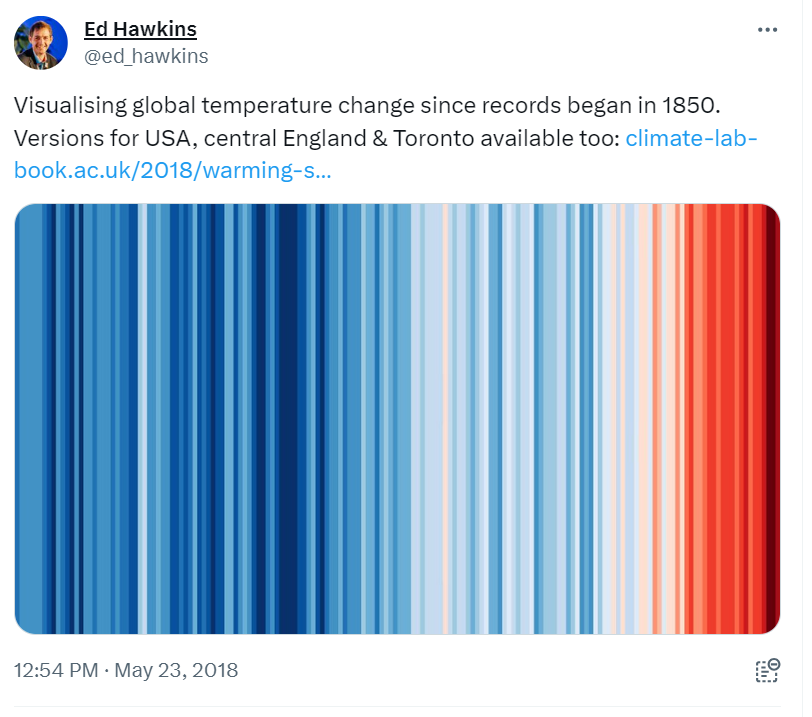

```{r setup, include=FALSE}
knitr::opts_chunk$set(
  echo      = T, 
  message   = F, 
  warning   = F, 
  comment   = NA,
  R.options = list(width = 120),
  cache.rebuild = F,
  cache = T,
  fig.align = 'center',
  fig.asp = .7,
  dev = 'svg',
  dev.args = list(bg = 'transparent')
)

library(ecmwfr)    # tải dữ liệu cds
library(tidyverse) # xử lý và trực quan hóa dữ liệu
library(sf)        # xử lý dữ liệu không gian dạng vector
library(stars)     # xử lý dữ liệu không gian dạng raster
# library(broom)
library(kableExtra)
# library(visibly)
#library(glmmTMB)
library(reactable)
library(patchwork)
library(tmap)      # hiển thị dữ liệu không gian
library(readxl)    # đọc dữ liệu Excel


kable_df <- function(..., digits=2) {
  kable(..., digits=digits) %>% 
    kable_styling(full_width = F)
}

rnd = tidyext::rnd #https://m-clark.github.io/tidyext/ #devtools::install_github('m-clark/tidyext')
theme_set(theme_bw())
```

**Warming stripes** được tạo ra bởi [Ed Hawkins năm
2018](https://x.com/ed_hawkins/status/999242147135188993) để trực quan
hóa sự ấm lên của toàn cầu do biến đổi khí hậu (Hình \@ref(fig:fig1)). Ý
tưởng của warming stripes cũng được áp dụng để trực quan hóa [suy giảm
đa dạng sinh học](https://biodiversitystripes.info/global).

```{r fig1, fig.cap="Ed Hawkins giới thiệu về warming stripes năm 2018", echo = FALSE, out.width="100%"}

```

Trong bài viết này mình sẽ dùng **warming stripes** để trực quan hóa
biến động nhiệt độ bề mặt nước biển (sea surface temperature anomaly) ở
Central and Southern North Sea (ICES division 4bc). Mình dùng dữ liệu
[HadISST](https://www.metoffice.gov.uk/hadobs/hadisst/index.html) từ năm
1870 đến năm 2021. Code sử dụng trong bài viết được tham khảo từ
[đây](https://dominicroye.github.io/en/2018/how-to-create-warming-stripes-in-r/).

# Tải và xử lý dữ liệu

Dữ liệu mình sử dụng đã được cắt theo một số khu vực ở vùng biển Châu Âu
từ dữ liệu gốc toàn cầu của HadISST. Dữ liệu có thể tải ở
[đây](https://github.com/bui-tuananh/bui-tuananh.github.io/blob/main/_posts/2024-12-20_warming-stripe/data/hadisst_ices.rds).
Tuy nhiên, để sử dụng cho bài viết này thì mình vẫn cần lọc lấy dữ liệu
Central and Southern North Sea, tính giá trị nhiệt độ trung bình cho cả
khu vực theo năm, và tính biến động nhiệt độ.

```{r}
# Thiết lập ban đầu
library(tidyverse)    # process data
library(lubridate)    # process date-time
library(RColorBrewer) # color palette
library(scales)       # check color 
```

```{r}
# Tải dữ liệu
hadisst <- read_rds(file.path("./data", "hadisst_ices.rds"))

# Xử lý dữ liệu
hadisst_year <- hadisst %>%
  # lọc dữ liệu Central and Southern North Sea
  filter(IcesArea == "4bc") %>%
  # tính giá trị nhiệt độ trung bình cho cả khu vực theo năm
  group_by(Year) %>%
  summarize(temp = mean(hadisst_degC)) %>%
  # tính biến động nhiệt độ
  mutate(c.temp = as.numeric(scale(temp, scale = F))) %>%
  # thêm dữ liệu date để tiện cho việc trực quan hóa 
  mutate(date = ymd(str_c(Year, "01-01", sep = "-")))
```

# Tạo bảng màu warming stripes

Bảng màu warming stripes bao gồm 8 màu bão hòa nhất ở sắc
[xanh](https://colorbrewer2.org/#type=sequential&scheme=Blues&n=9) và
sắc [đỏ](https://colorbrewer2.org/#type=sequential&scheme=Reds&n=9) từ
bảng 9 màu đơn sắc của ColorBrewer.

```{r fig2, fig.cap="Bảng màu warming stripes", echo = TRUE, out.width="50%"}
stripe_red <- brewer.pal(9, "Reds")[2:9]
stripe_blue <- brewer.pal(9, "Blues")[2:9]
col_stripe <- c(rev(stripe_blue), stripe_red)

# hiển thị bảng màu
scales::show_col(col_stripe)
```

Ngoài ra để cho đẹp thì cũng cần tạo theme

```{r}
theme_stripe <- theme_minimal()+
                 theme(axis.text.y = element_blank(),
                       axis.line.y = element_blank(),
                       axis.title = element_blank(),
                       panel.grid.major = element_blank(),
                       legend.title = element_blank(),
                       axis.text.x = element_text(vjust = 3),
                       panel.grid.minor = element_blank(),
                       plot.title = element_text(size = 14, face = "bold"),
                       plot.subtitle = element_text(size = 8),
                       legend.position = "bottom"
                       )
```

# Warming stripes - Central and Southern North Sea

```{r fig3, fig.cap="Warming stripes - Central and Southern North Sea", echo = TRUE, out.width="100%"}
# thiết lập các khoảng ngắt của chú thích (legend)
# range(hadisst_year$c.temp) #-1.2 - 1.6
limits = c(-1.6, 1.6)
breaks = c(-1.6, -1, -0.5, 0, 0.5, 1, 1.6)

# warming stripes
ggplot(hadisst_year,
             aes(x = date, y = 1, fill = c.temp)) +
        geom_tile() +
           scale_x_date(date_breaks = "30 years",
                     date_labels = "%Y",
                     expand = c(0, 0)) +
           scale_y_continuous(expand = c(0, 0)) +
           scale_fill_gradientn(colors = col_stripe,
                                limits= limits,
                                breaks = breaks) +
            guides(fill = guide_colorbar(barheight = 0.5, barwidth = 10)) +
            labs(title = "Central and Southern North Sea | 1870-2021",
                 subtitle = "Data: Hadley Centre Sea Ice and Sea Surface TemperatureTemperature Analysis")+
              theme_stripe  
```
