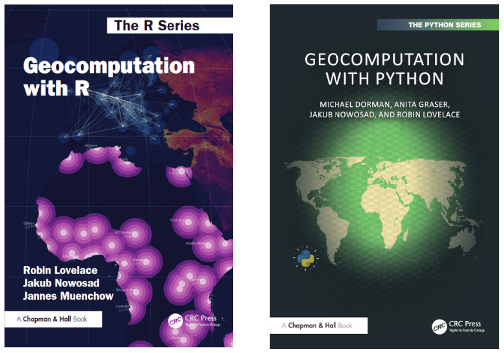
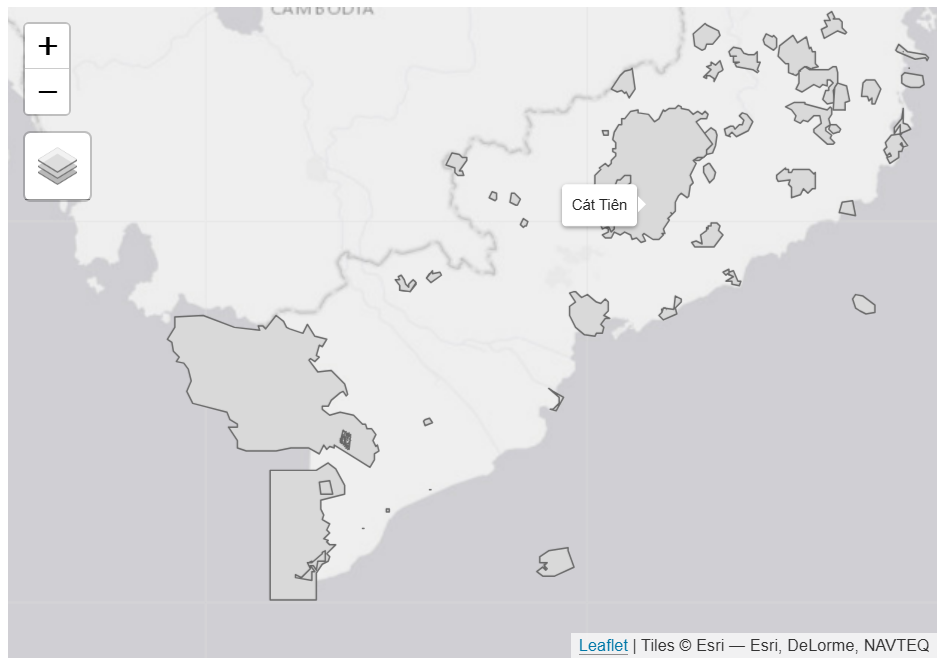

```{r setup, include=FALSE}
knitr::opts_chunk$set(
  echo      = T, 
  message   = F, 
  warning   = F, 
  comment   = NA,
  R.options = list(width = 120),
  cache.rebuild = F,
  cache = T,
  fig.align = 'center',
  fig.asp = .7,
  dev = 'svg',
  dev.args = list(bg = 'transparent')
)

# library(ecmwfr)    # tải dữ liệu cds
# library(tidyverse) # xử lý và trực quan hóa dữ liệu
# library(sf)        # xử lý dữ liệu không gian dạng vector
# library(stars)     # xử lý dữ liệu không gian dạng raster
# # library(broom)
library(kableExtra)
# # library(visibly)
# #library(glmmTMB)
# library(reactable)
# library(patchwork)
# library(tmap)      # hiển thị dữ liệu không gian
# library(readxl)    # đọc dữ liệu Excel


kable_df <- function(..., digits=2) {
  kable(..., digits=digits) %>% 
    kable_styling(full_width = F)
}

rnd = tidyext::rnd #https://m-clark.github.io/tidyext/ #devtools::install_github('m-clark/tidyext')
#theme_set(theme_bw())
```

Nhân dịp năm mới, mình muốn chia sẻ 2 cuốn sách về Geocomputation trên R
và Python (Hình \@ref(fig:fig1)). Cả 2 cuốn sách đều có thể đọc miễn phí
online tại <https://r.geocompx.org/> (sách cho R) và tại
<https://py.geocompx.org/> (sách cho Python).

```{r fig1, fig.cap="2 cuốn sách về Geocomputation trên R và trên Python", echo = FALSE, out.width="100%"} 

```

Mình dùng R nên mới đọc cuốn sách cho R. Thi thoảng không nhớ code thì
mình sẽ tham khảo chương [6. Raster-vector
interactions](https://r.geocompx.org/raster-vector) và chương [9. Making
maps with R](https://r.geocompx.org/adv-map). Trong chương 6, cũng như
các chương khác của sách, thì tác giả sử dụng package
[*terra*](https://rspatial.github.io/terra/) cho việc xử lý dữ liệu
raster. *terra* rất mạnh, đặc biệt với dữ liệu lớn (vài GB), nhưng cá
nhân mình thích dùng package
[*stars*](https://r-spatial.github.io/stars/)hơn vì tương thích với
package [*sf*](https://r-spatial.github.io/sf/) (dùng cho việc xử lý dữ
liệu vector). Trong chương 9, tác giả sử dụng package
[*tmap*](https://r-tmap.github.io/tmap/)để tạo bản đồ. Mình cũng thích
dùng *tmap* vì có thể tạo các bản đồ tương tác, ví dụ như trong bài viết
[Tải dữ liệu khu bảo tồn từ The World Database on Protected
Areas](https://bui-tuananh.github.io/posts/2024-09-21_get-World-Database-on-Protected-Area/)
(Hình \@ref(fig:fig2)). Ngoài ra khi tạo các bản đồ tĩnh, mình cũng dùng
cả *ggplot2.*

```{r fig2, fig.cap="Bản đồ tương tác tạo bởi tmap", echo = FALSE, out.width="100%"} 

```