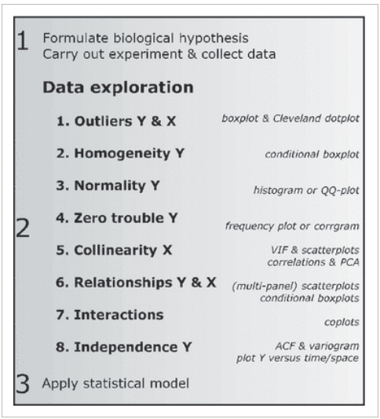
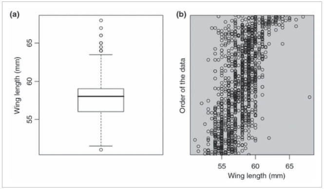
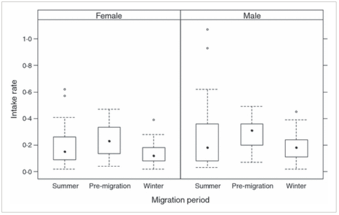
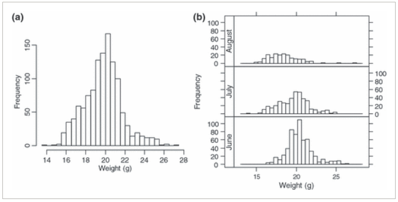
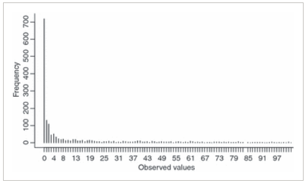
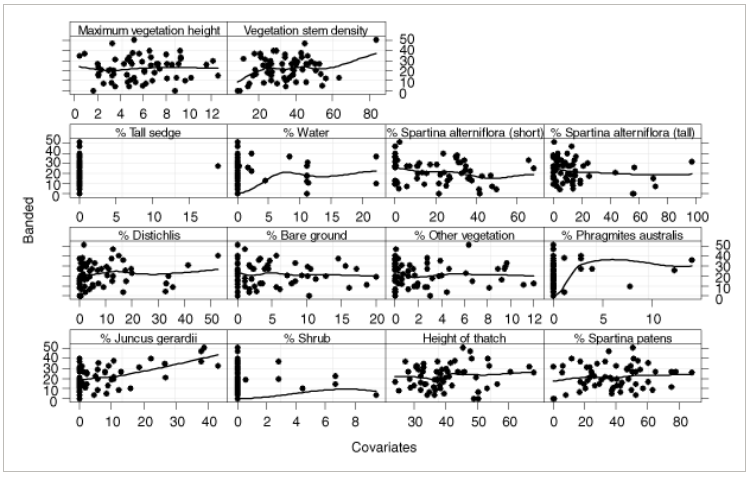
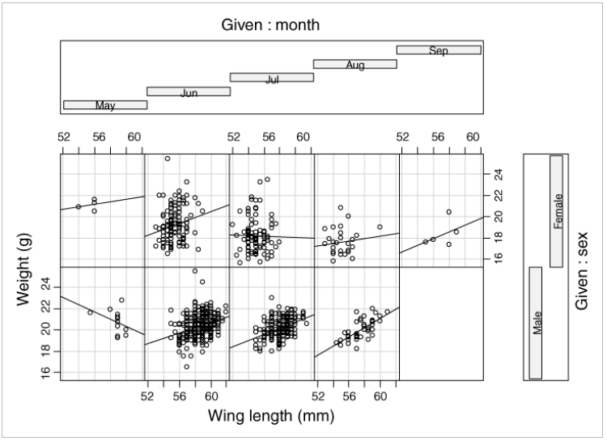
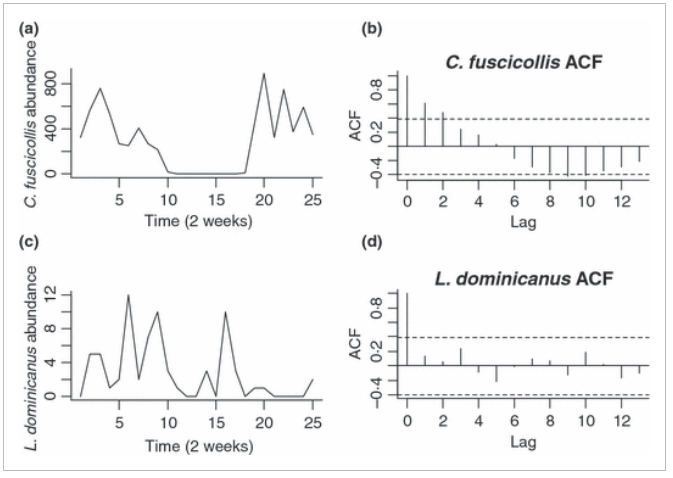

```{r setup, include=FALSE}
knitr::opts_chunk$set(
  echo      = T, 
  message   = F, 
  warning   = F, 
  comment   = NA,
  R.options = list(width = 120),
  cache.rebuild = F,
  cache = T,
  fig.align = 'center',
  fig.asp = .7,
  dev = 'svg',
  dev.args = list(bg = 'transparent')
)

# library(ecmwfr)    # tải dữ liệu cds
# library(tidyverse) # xử lý và trực quan hóa dữ liệu
# library(sf)        # xử lý dữ liệu không gian dạng vector
# library(stars)     # xử lý dữ liệu không gian dạng raster
# # library(broom)
# library(kableExtra)
# # library(visibly)
# #library(glmmTMB)
# library(reactable)
# library(patchwork)
# library(tmap)      # hiển thị dữ liệu không gian
# library(readxl)    # đọc dữ liệu Excel


# kable_df <- function(..., digits=2) {
#   kable(..., digits=digits) %>% 
#     kable_styling(full_width = F)
# }
# 
# rnd = tidyext::rnd #https://m-clark.github.io/tidyext/ #devtools::install_github('m-clark/tidyext')
# #theme_set(theme_bw())
```

Khám phá dữ liệu là một bước quan trọng để hiểu dữ liệu và đảm bảo việc
lựa chọn đúng phương pháp phân tích. Trong bài báo [A protocol for data
exploration to avoid common statistical
problems](https://besjournals.onlinelibrary.wiley.com/doi/10.1111/j.2041-210X.2009.00001.x),
Alain Zuur, một nhà nghiên cứu có nhiều công trình về phân tích dữ liệu
trong sinh thái học, đã tổng hợp 8 bước khám phá dữ liệu (Hình
\@ref(fig:fig1)). Bài báo cũng có file R với các function có thể được
dùng để làm theo các bước giới thiệu trong bài báo.

```{r fig1, fig.cap="8 bước khám phá dữ liệu (Hình 1 trong Zuur et al., 2010)", echo = FALSE, out.width="70%"}

```

1.  Outliers Y & X: Outliers là những quan sát có giá trị lớn hoặc nhỏ
    bất thường so với các quan sát khác. Outliers có thể được xác định
    bằng boxplot kết hợp với Cleveland dotplot (Hình \@ref(fig:fig2)).

```{r fig2, fig.cap="Ví dụ về việc xác định outlier sử dụng boxplot và Cleveland dotplot. Nếu chỉ dùng boxplot thì có 7 điểm được cân nhắc là outlier (hình a) nhưng khi kết hợp với Cleveland thì có vẻ không có điểm nào quá khác biệt (hình b) (Hình 2 trong Zuur et al., 2010)", echo = FALSE, out.width="70%"}

```

2.  Homogeneity Y: Homogeneity Y là một giả định quan trọng của các phân
    tích thông dụng như ANOVA, linear regression (hồi quy tuyến tính).
    Homogeneity có thể được kiểm tra bằng boxplot của giá trị quan sát
    (Hình \@ref(fig:fig3)), hoặc so sánh residual (phần dư - sự khác
    biệt giữa giá trị dự đoán và giá trị quan sát) với giá trị dự đoán.
    Nếu sự biến thiên (variation) của residual là đồng nhất giữa các giá
    trị dự đoán thì giả định Homogeneity không bị vi phạm.

```{r fig3, fig.cap="Ví dụ về việc kiểm tra Homogeneity Y bằng boxplot của giá trị quan sát. Sự biến thiên của Intake rate giữa các tháng có vẻ đồng nhất, nhưng có vẻ thấp hơn một chút trong mùa đông ở con cái so với con đực. Tuy nhiên sự khác biệt là không quá đáng kể (Hình 4 trong Zuur et al., 2010)", echo = FALSE, out.width="70%"}

```

3.  Normality Y: Tương tự như Homogeneity Y, Normality Y là một giả định
    quan trọng của ANOVA, linear regression. Normality có thể được kiểm
    tra bằng histogram của giá trị quan sát (Hình \@ref(fig:fig4)) hoặc
    của QQ plot của residual. Trong trường hợp Y không có phân bố chuẩn,
    Y có thể được biến đổi, ví dụ như lấy log.

```{r fig4, fig.cap="Ví dụ về việc kiểm tra Normality Y bằng histogram của giá trị quan sát. Histogram tổng thể trông có vẻ không tuân theo Normality. Tuy nhiên sự khác biệt là do phân bố giữa các tháng khác nhau. Vì thế, trong trường hợp này không nên biến đổi dữ liệu vì có thể giảm khả năng xác định ảnh hưởng của tháng (Hình 5 trong Zuur et al., 2010)", echo = FALSE, out.width="70%"}

```

4.  Zero trouble Y: Trong một số trường hợp, dữ liệu thu thập có thể gồm
    rất nhiều giá trị 0, ví dụ như dữ liệu sự xuất hiện của loài. Việc
    này có thể kiểm tra bằng histogram (Hình \@ref(fig:fig5)). Trong
    trường hợp có nhiều giá trị 0, phương pháp zero inflated GLMs nên
    được cân nhắc.

```{r fig5, fig.cap="Ví dụ về việc kiểm tra Zero trouble Y bằng histogram (Hình 7 trong Zuur et al., 2010)", echo = FALSE, out.width="70%"}

```

5.  Collinearity X: Collinearity là sự tương quan giữa các biến X, ví dụ
    như giữa chiều dài và cân nặng (một cá thể dài thường có cân nặng
    lớn) hoặc giữa độ sâu và nhiệt độ đáy biển (càng xuống sâu thì nhiệt
    độ càng thấp). Collinearity có thể gây nhiễu khi phân tích.
    Collinearity có thể được kiểm tra bằng cách tính variance inflation
    factor (VIF) và loại bỏ dần các biến có giá trị VIF cao đến khi tất
    cả các biến có VIF dưới một ngưỡng nhất định. Bài báo đề xuất ngưỡng
    VIF là 3.

6.  Relationship Y & X: Mối quan hệ giữa Y và X (tuyến tính hoặc không
    tuyến tính) có thể được kiểm tra bằng scatterplot (Hình
    \@ref(fig:fig6)). Lưu ý là nếu scatterplot không thể hiện mối quan
    hệ rõ ràng không đồng nghĩa với việc không có mối quan hệ giữa biến
    Y và X, chỉ là không đủ rõ ràng để có thể quan sát từ scatterplot.

```{r fig6, fig.cap="Ví dụ về việc kiểm tra Relationship Y & X bằng scatterplot (Hình 9 trong Zuur et al., 2010)", echo = FALSE, out.width="70%"}

```

7.  Interactions: Tương tự như việc kiểm tra mối quan hệ giữa Y và X. Sự
    tương tác (mối quan hệ giữa Y và X khác nhau giữa các nhóm của X)
    cũng có thể được kiểm tra sử dụng scatterplot (Hình
    \@ref(fig:fig7)).

```{r fig7, fig.cap="Ví dụ về việc kiểm tra Interactions bằng scatterplot. Mối quan hệ giữa cân nặng và chiều dài cánh có thể khác nhau giữa các tháng và giới (Hình 11 trong Zuur et al., 2010)", echo = FALSE, out.width="70%"}

```

8.  Independence Y: Tương tự như homogeneity và normality Y,
    independence Y cũng là một giả định quan trọng. Ví dụ như các quan
    sát trong cùng một năm hoặc từ cùng một quần thể/khu vực có thể
    không độc lập với nhau. Tính độc lập theo thời gian và không gian có
    thể được kiểm tra, lần lượt, bằng auto-correlation function (ACF)
    (Hình \@ref(fig:fig8)) và variogram. Trong trường hợp các quan sát
    không độc lập, mixed-effects models có thể được sử dụng (xem bài
    viết [Mô hình hỗn hợp (Mixed-effects model)
    1](https://bui-tuananh.github.io/posts/2024-10-13_mixed-model-intercept/)).

```{r fig8, fig.cap="Ví dụ về việc kiểm tra Independence Y bằng AFC. Với loài C. fuscicollis, Independence Y bị vi phạm do quan sát tại năm t sẽ phụ thuộc vào quan sát ở năm t-1 và năm t-2 (ACF cao hơn đường gạch ngang ở lag 1 và 2). Với loài L. dominicanus, các quan sát dữa các năm độc lập với nhau (ACF không cao hơn đường gạch ngang). (Hình 12 trong Zuur et al., 2010)", echo = FALSE, out.width="70%"}

```
