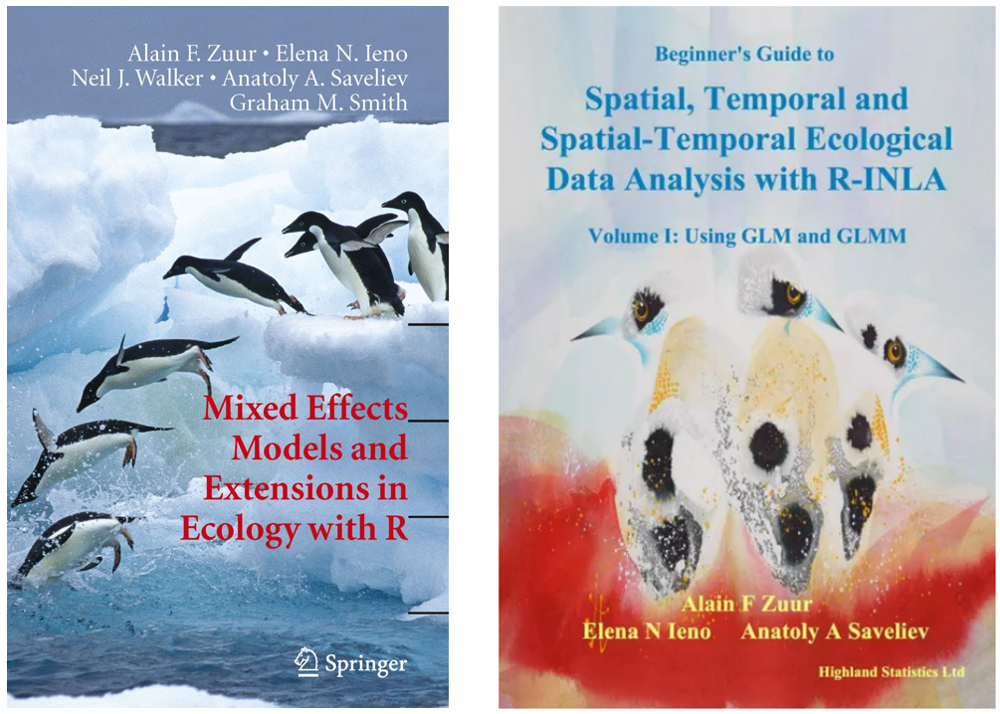

```{r setup, include=FALSE}
knitr::opts_chunk$set(
  echo      = T, 
  message   = F, 
  warning   = F, 
  comment   = NA,
  R.options = list(width = 120),
  cache.rebuild = F,
  cache = T,
  fig.align = 'center',
  fig.asp = .7,
  dev = 'svg',
  dev.args = list(bg = 'transparent')
)

# library(ecmwfr)    # tải dữ liệu cds
# library(tidyverse) # xử lý và trực quan hóa dữ liệu
# library(sf)        # xử lý dữ liệu không gian dạng vector
# library(stars)     # xử lý dữ liệu không gian dạng raster
# # library(broom)
# library(kableExtra)
# # library(visibly)
# #library(glmmTMB)
# library(reactable)
# library(patchwork)
# library(tmap)      # hiển thị dữ liệu không gian
# library(readxl)    # đọc dữ liệu Excel


# kable_df <- function(..., digits=2) {
#   kable(..., digits=digits) %>% 
#     kable_styling(full_width = F)
# }
# 
# rnd = tidyext::rnd #https://m-clark.github.io/tidyext/ #devtools::install_github('m-clark/tidyext')
# #theme_set(theme_bw())
```

Trong bài viết trước, mình giới thiệu một bài báo của Alain Zuur về 8
Bước khám phá phá dữ liệu. Alain Zuur là một nhà nghiên cứu có nhiều
công trình về phân tích dữ liệu trong sinh thái học. Mình rất thích đọc
sách của Alain Zuur vì cách diễn đạt dễ hiểu, không quá nặng lý thuyết
toán học, nhưng vẫn đủ thông tin chuyên sâu để có thể tham khảo khi cần.
Mình mới đọc 2 cuốn sách: Mixed effects model and extensions in ecology
with R và Beginner's guide to spatial, temporal, and spatial-temporal
ecological data analysis with R-INLA (Hình \@ref(fig:fig1)) do chủ yếu
sử dụng mixed effects và spatial-temporal model. Mình cũng muốn đọc thêm
các sách về GAM và GLM nhưng chưa có cơ hội.

Thông tin về tất cả các sách cũng như các khoá học bởi Alain Zuur có thể
xem ở [đây](https://www.highstat.com/index.php).

```{r fig1, fig.cap="Sách Mixed effects model and extensions in ecology with R và Beginner's guide to spatial, temporal, and spatial-temporal ecological data analysis with R-INLA", echo = FALSE, out.width="70%"}

```
