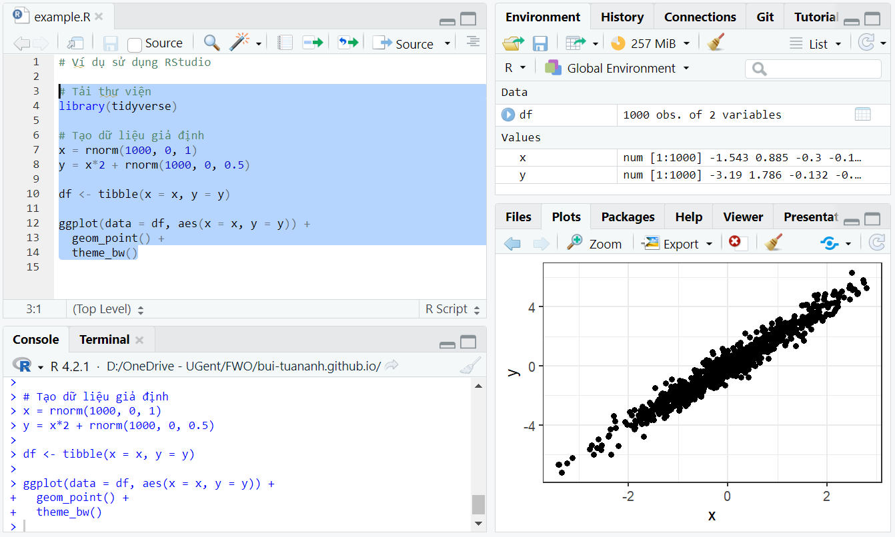
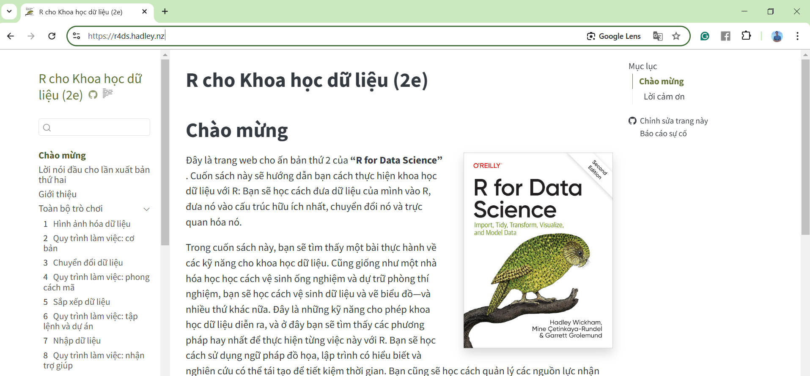

```{r setup, include=FALSE}
knitr::opts_chunk$set(
  echo      = T, 
  message   = F, 
  warning   = F, 
  comment   = NA,
  R.options = list(width = 120),
  cache.rebuild = F,
  cache = T,
  fig.align = 'center',
  fig.asp = .7,
  dev = 'svg',
  dev.args = list(bg = 'transparent')
)

# library(ecmwfr)    # tải dữ liệu cds
# library(tidyverse) # xử lý và trực quan hóa dữ liệu
# library(sf)        # xử lý dữ liệu không gian dạng vector
# library(stars)     # xử lý dữ liệu không gian dạng raster
# # library(broom)
# library(kableExtra)
# # library(visibly)
# #library(glmmTMB)
# library(reactable)
# library(patchwork)
# library(tmap)      # hiển thị dữ liệu không gian
# library(readxl)    # đọc dữ liệu Excel
# library(lme4)
# library(AICcmodavg)
# library(effects)
# library(lattice)
# library(plyr)

# kable_df <- function(..., digits=2) {
#   kable(..., digits=digits) %>%
#     kable_styling(full_width = F)
# }
# 
# rnd = tidyext::rnd #https://m-clark.github.io/tidyext/ #devtools::install_github('m-clark/tidyext')
# #theme_set(theme_bw())
```

R là một “môi trường phần mềm miễn phí dành cho tính toán thống kê và đồ
họa” được dùng phổ biến trong nghiên cứu khoa học. Lợi ích của việc dùng
R có thể xem ở bài viết [R 101 \| 7 Lý do nên dùng
R](http://127.0.0.1:5500/posts/2024-08-22_reasons-to-use-R/). Trong bài
viết này mình sẽ chia sẻ kinh nghiệm của mình về việc học R từ con số 0.

1.  Cài [RStudio](https://posit.co/download/rstudio-desktop/): RStudio
    là một phần mềm giúp cho việc sử dụng R dễ dàng hơn. Ví dụ, bạn có
    thể quản lý các file code (góc trái Hình \@ref(fig:fig1)), các dữ
    liệu trong quá trình làm việc (góc phải phía trên Hình
    \@ref(fig:fig1)), cũng như hiển thị dữ liệu (góc phải phía dưới Hình
    \@ref(fig:fig1)).

```{r fig1, fig.cap="Giao diện RStudio", echo = FALSE, out.width="100%"}

```

2.  Học các kiến thức R cơ bản: bạn có thể học kiến thức R cơ bản miễn
    phí từ sách [R for Data Science](https://r4ds.hadley.nz/). Có thể
    bạn sẽ cảm thấy việc học các kiến thức cơ bản hơi nhàm chán và chậm
    chạp, trong khi bạn muốn bắt đầu vào thực hành ngay. Tuy nhiên, việc
    nắm vững các kiến thức cơ bản rất quan trọng vì sẽ giúp bạn có thể
    thực hành R rất nhanh sau này. Một số mục mình thấy quan trọng với
    người mới học bao gồm: Whole game, Visualize, Transform, Import
    (Spreadsheets), và có thể cả Program. Sách không có bản tiếng Việt
    nhưng có thể dùng google translate trong Chrome để dịch (Hình
    \@ref(fig:fig2)).

```{r fig2, fig.cap="Nội dung sách R for Data Science được dịch bằng google translate", echo = FALSE, out.width="100%"}

```

3.  Thực hành: sau khi học xong các kiến thức cơ bản thì bạn nên thực
    hành R càng nhiều càng tốt, đúng theo phương châm "trăm hay không
    bằng tay quen". Tốt nhất là bạn có thể áp dụng R vào công việc
    nghiên cứu của mình. Còn nếu chưa có dự án riêng thì có thể học theo
    các nghiên cứu đã công bố, đặc biệt là công bố nào có bao gồm cả dữ
    liệu và code R của các bước xử lý và phân tích, ví dụ như ở
    [đây](https://github.com/maxlindmark/perch-growth). Trong quá trình
    thực hành thì AI như chatgpt/deepseek sẽ có thể là bạn thân của bạn,
    giúp bạn học và làm nhanh hơn.
